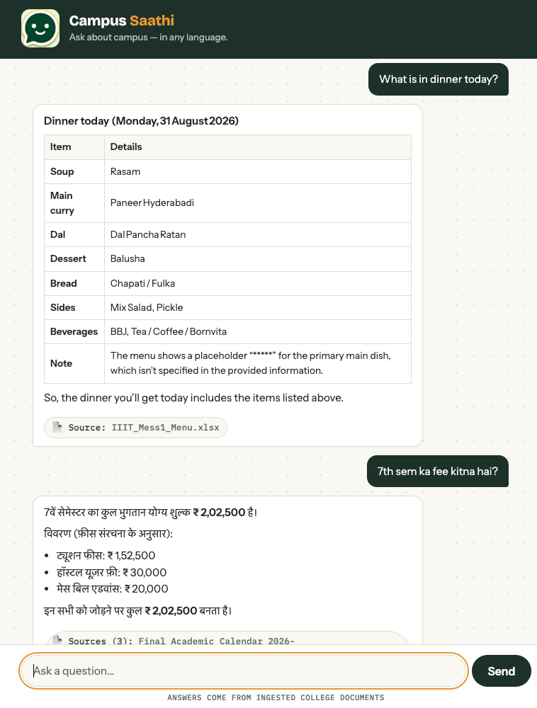
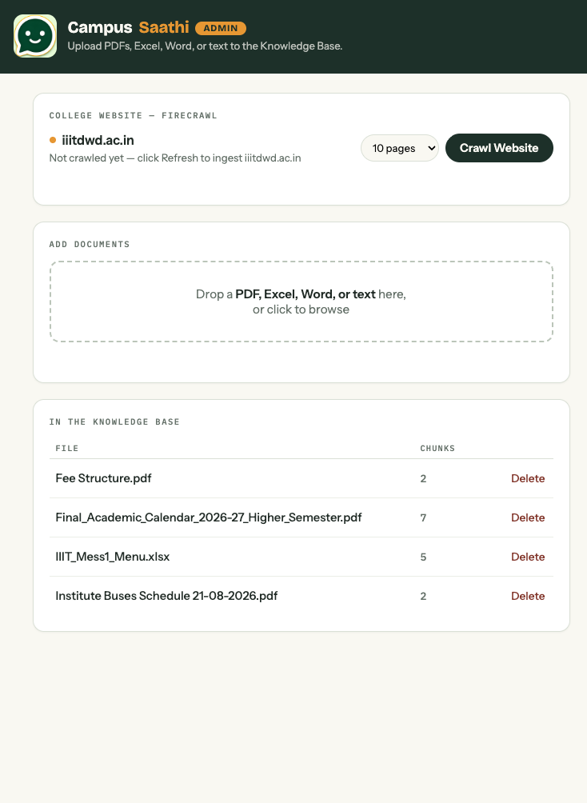
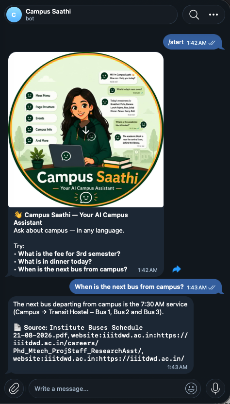
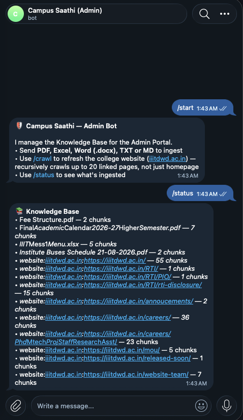
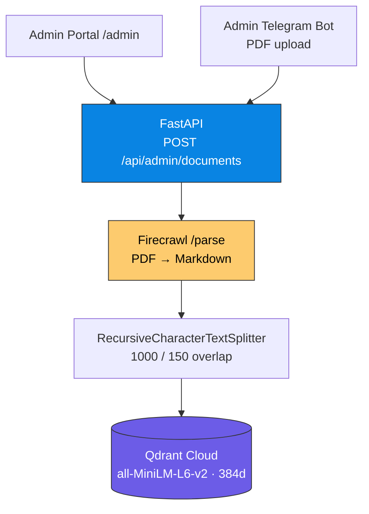
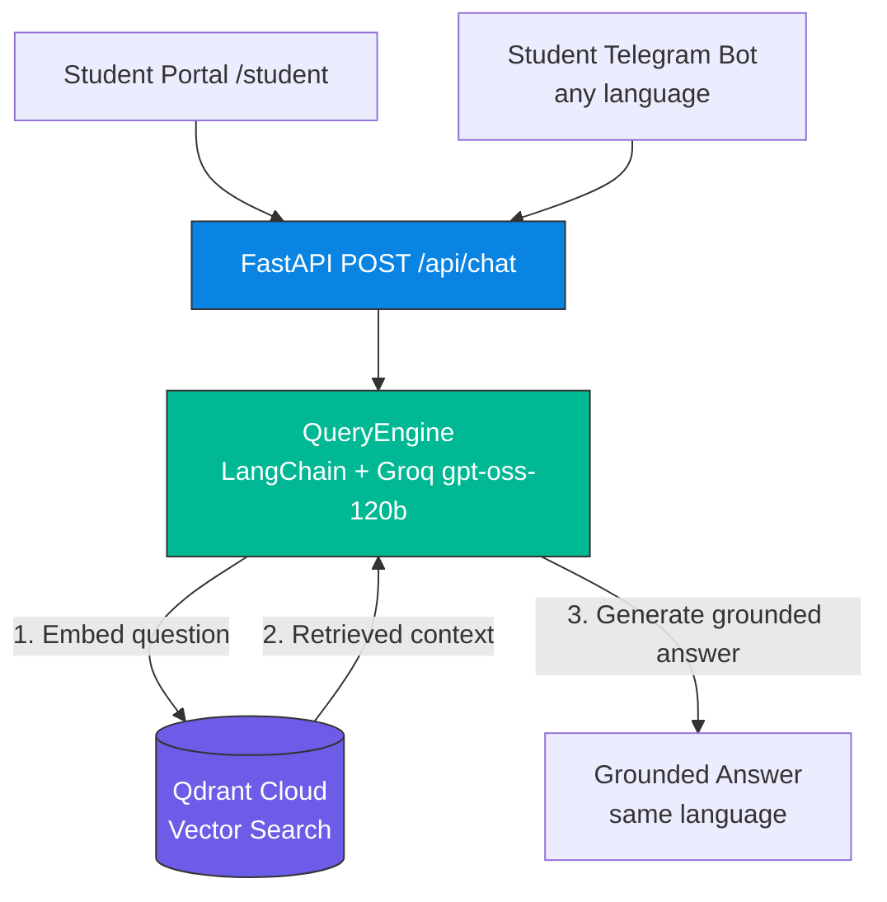
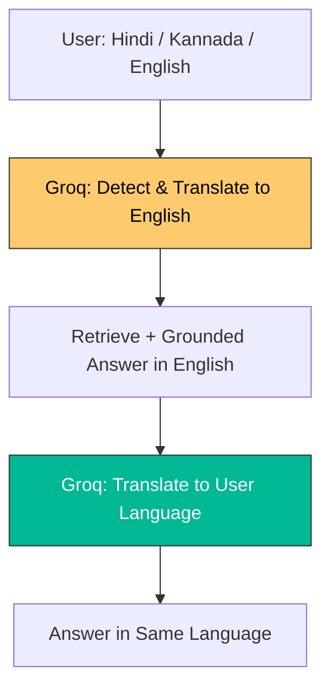

# Campus Saathi

**RAG-powered campus assistant for IIIT Dharwad — ask in any language, get grounded answers from college documents.**

### Live Demo

| Portal | Link |
|---|---|
| Student — ask questions | [campus-saathi-system.onrender.com/student/](https://campus-saathi-system.onrender.com/student/) |
| Admin — upload & manage documents | [campus-saathi-system.onrender.com/admin/](https://campus-saathi-system.onrender.com/admin/) |
| Telegram — Student Bot | [@CampusSaathi_Bot](https://t.me/CampusSaathi_Bot) |
| Telegram — Admin Bot | [@CampusSaathiAdmin_Bot](https://t.me/CampusSaathiAdmin_Bot) |

---

## Screenshots

| Student Portal | Admin Portal |
|---|---|
|  |  |

| Student Telegram Bot | Admin Telegram Bot |
|---|---|
|  |  |

---

## What it does

- **Student** asks a question in any language → answer in the same language, grounded in ingested PDFs. No hallucination.
- **Admin** uploads a PDF → parsed, chunked, embedded, and searchable in seconds. Can list and delete documents.
- Same RAG pipeline serves **Web and Telegram** — no duplicate logic.

---

## Architecture

### 1. Ingestion — Admin Side

PDFs enter only from Admin surfaces. Parsed, chunked, and embedded into Qdrant.



### 2. Retrieval — Student Side

Students query in any language. Answer is grounded in Qdrant chunks, returned in the same language.



> Both flows share one **Qdrant collection** and are served from one **FastAPI** origin on Render. No duplicate logic.

### 3. Multilingual Flow

Ask in any language — Hindi, Kannada, English, etc. The query is translated to English for retrieval, then Groq generates the grounded answer back in your original language.



---

## Tech Stack

| Layer | Choice | Why |
|---|---|---|
| RAG Framework | **LangChain** | Chain + text splitting |
| LLM | **Groq** `openai/gpt-oss-120b` | Fast, open-weight, OpenAI-compatible API |
| Vector DB | **Qdrant Cloud** | Managed, server-side embeddings |
| Embeddings | `all-MiniLM-L6-v2` (384d) via Qdrant Inference | No local model to host |
| PDF Parsing | **Firecrawl** `/parse` | Clean markdown output |
| Backend | **FastAPI** + **python-telegram-bot** | Webhooks + portals on one origin |
| Frontend | HTML/CSS/vanilla JS | No build step, zero dependencies |
| Deploy | **Render** | Single service for API + portals + bots |

---

## API

| Method | Path | Description |
|---|---|---|
| `POST` | `/api/chat` | `{message}` → `{answer}` |
| `POST` | `/api/admin/documents` | Upload PDF → `{filename, chunks}` |
| `GET` | `/api/admin/documents` | List all documents |
| `DELETE` | `/api/admin/documents/{filename}` | Delete a document |

Portals: `/student` and `/admin` (same origin). Telegram webhooks: `POST /student-webhook` and `POST /admin-webhook`.

---

## Project Structure

```
campus_saathi/
├── main.py                 # FastAPI app + lifespan (bots, webhooks)
├── student_bot.py          # Student Telegram bot
├── admin_bot.py            # Admin Telegram bot
├── backend/
│   ├── api.py              # Routes + portal mounting
│   ├── vector_store.py     # Qdrant adapter (KnowledgeBase)
│   ├── pdf_processor.py    # Firecrawl + chunking + upsert
│   ├── query_engine.py     # LangChain RAG chain on Groq
│   └── website_crawler.py  # College site crawler (Firecrawl)
├── frontend/
│   ├── student/index.html
│   └── admin/index.html
├── tests/                  # HTTP-seam tests (faked adapters, no live keys)
├── scripts/live_check.py   # Manual check against real services
├── documents/              # Sample PDFs
├── requirements.txt
└── Procfile                # Render: web: python main.py
```

External services are behind small adapters — swapping a provider touches one file.

---

## Local Setup

**Prereqs:** Python 3.14, Qdrant Cloud cluster, Groq key, Firecrawl key, 2 Telegram bot tokens.

```bash
git clone https://github.com/Kamal-Nayan-Kumar/campus_saathi.git
cd campus_saathi

uv venv --python 3.14
source .venv/bin/activate
uv pip install -r requirements.txt

cp .env.example .env
# fill: TELEGRAM_*_TOKEN, WEBHOOK_URL, GROQ_API_KEY, QDRANT_URL, QDRANT_API_KEY, FIRECRAWL_API_KEY

python main.py
# → http://localhost:8000/student/  http://localhost:8000/admin/
```

Leave `WEBHOOK_URL` empty for local-only testing. Set it to your public URL (ngrok / Render) to enable Telegram bots.

---

## Testing

```bash
pytest -q          # 11 tests, no live keys needed
```

Tests use FastAPI `TestClient` with faked adapters. Covers chat, upload, list, delete, and error states.

---

## Deployment

Deployed on **Render** via `Procfile`. Auto-deploy on `master`.

Env vars on Render: `GROQ_API_KEY`, `QDRANT_URL`, `QDRANT_API_KEY`, `FIRECRAWL_API_KEY`, `TELEGRAM_STUDENT_BOT_TOKEN`, `TELEGRAM_ADMIN_BOT_TOKEN`, `WEBHOOK_URL=https://campus-saathi-system.onrender.com`.